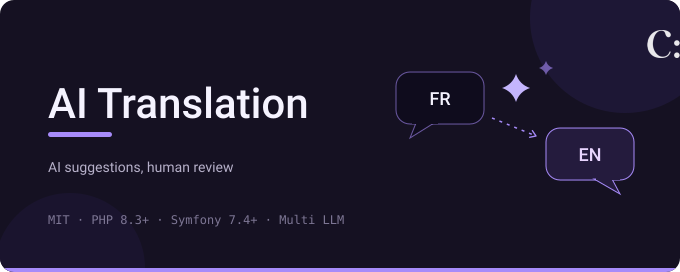

# AI Translation Bundle

[](LICENSE)
[](https://packagist.org/packages/cyllene-digital/ai-translation-bundle)
[](https://github.com/CylleneDigital/AiTranslationBundle/actions/workflows/build.yaml)
[](https://github.com/CylleneDigital/AiTranslationBundle/actions/workflows/security.yaml)

A **Symfony bundle** to edit your application's translations at runtime: overrides are stored
in the database and applied on top of your `translations/` files, which are never modified,
and **AI suggestions** fill the missing keys, applied only once a human approves them.

It is an **engine without user interface**: a console and a PHP API, on which any application
can build its own screens.

## Compatibility

| Component | Versions |
|---|---|
| PHP | `^8.3` |
| Symfony | `^7.4 \|\| ^8.0` |
| Doctrine ORM | `^3.5` (DBAL 3 or 4) |
| Database | MySQL, MariaDB, PostgreSQL, SQLite |
| PHP extensions | `dom`, `libxml`; `intl` recommended: without it, ICU overrides are served as stored and an invalid ICU pattern is not caught at save time |

An API key for at least one AI provider (OpenAI, Anthropic, DeepL, or any OpenAI-compatible
server such as Mistral or a local Ollama) is needed for the suggestions; the overrides work
without.

## What this bundle does

- **Overrides**: every `trans()` call checks the database first, then falls back to the files
  ([concepts/overrides.md](docs/concepts/overrides.md))
- **AI suggestions**: by default only for the keys missing in a locale, kept *pending* until reviewed
  ([concepts/suggestions.md](docs/concepts/suggestions.md))
- **Coverage**: how much of each locale is translated, enforceable in CI
  ([concepts/coverage.md](docs/concepts/coverage.md))
- **Import / export**: the overrides as XLIFF or CSV, for backups and translators
  ([operations/commands.md](docs/operations/commands.md))
- **Scopes**: optional per-site, per-brand or per-channel values
  ([concepts/scopes.md](docs/concepts/scopes.md))

## Installation

```bash
composer require cyllene-digital/ai-translation-bundle
```

The Flex recipe registers the bundle and adds a commented
`config/packages/cyllene_digital_ai_translation.yaml` (it is a contrib recipe: answer "yes" when
Flex asks, or set `"allow-contrib": true` under `extra.symfony` once and for all). Without Flex:

```php
// config/bundles.php
CylleneDigital\AiTranslationBundle\CylleneDigitalAiTranslationBundle::class => ['all' => true],
```

The bundle ships its entity mapping, not migrations: generate one in your application (with
`doctrine/doctrine-migrations-bundle`; `doctrine:schema:update` does without it):

```bash
bin/console doctrine:migrations:diff && bin/console doctrine:migrations:migrate
```

Run the diff again after each bundle update: a mapping change needs its own migration.

*On DBAL 3, set `doctrine.dbal.use_savepoints: true` ([why](docs/operations/doctrine-dbal-3.md)).*

## Configuration

The minimal configuration declares one AI provider:

```yaml
# config/packages/cyllene_digital_ai_translation.yaml
cyllene_digital_ai_translation:
    providers:
        openai:
            type: openai            # or anthropic, deepl, default (any /chat/completions API)
            api_key: '%env(OPENAI_API_KEY)%'
```

Every other key (translations path, default locale, extra translation roots, AI context,
cache TTLs) has a default: **[configuration reference](docs/configuration-reference.md)**.
Each provider type has its own page: **[provider bridges](docs/index.md)**.

## How to start

1. **Open the console**, a menu of guided tasks: browse and edit translations, generate and
   review suggestions, import, export, coverage.

   ```bash
   bin/console cyllene:ai-translation
   ```

2. **Generate suggestions** for a locale, the cost estimate first, then for real:

   ```bash
   bin/console cyllene:ai-translation:generate --target=fr --dry-run
   bin/console cyllene:ai-translation:generate --target=fr
   ```

3. **Review them** in the console ("Review the pending suggestions"): approving one writes the
   override, served right away; it writes nothing when the entry already shows that value,
   and removes the stored override when the approved value is the one the entry falls back
   to.

4. **Check the coverage**, in CI if you like (`--min=95` fails under 95 %):

   ```bash
   bin/console cyllene:ai-translation:coverage
   ```

Every command and its options: [docs/operations/commands.md](docs/operations/commands.md).

## Synchronous vs asynchronous generation

### Synchronous generation (default)

Out of the box, generation is **synchronous**: it runs where it is called, with nothing more to
install or configure. That is how the console works: `cyllene:ai-translation` and `generate`
run the generation in the command, show its progress and return a meaningful exit code.

### Asynchronous generation

To run generation in a worker instead, add the Doctrine transport:

```bash
composer require symfony/doctrine-messenger
```

The bundle then configures the rest itself: a `cyllene_ai_translation` transport (a queue in
your database, never retried: a retry would bill the provider twice), with
`GenerateSuggestionsMessage` routed to it.

From your code, dispatch one message per catalogue and target locale:

```php
use CylleneDigital\AiTranslationBundle\Message\GenerateSuggestionsMessage;
use Symfony\Component\Messenger\MessageBusInterface;

final class TranslateCatalogue
{
    public function __construct(private readonly MessageBusInterface $bus)
    {
    }

    public function __invoke(): void
    {
        // catalogue, target locale, source locale
        $this->bus->dispatch(new GenerateSuggestionsMessage('messages', 'fr', 'en'));
    }
}
```

Dispatch it on a bus **without** the `doctrine_transaction` middleware. Sylius' default bus has
it, and a run inside a transaction is refused: a rollback would discard suggestions the provider
has already billed. [Never on a transactional bus](docs/configuration-reference.md#messenger-transport)
shows a dedicated bus.

And run a worker:

```bash
bin/console messenger:consume cyllene_ai_translation
```

The console stays synchronous either way: it never dispatches the message. Another broker
(RabbitMQ, Redis…), your own routing, the failure transport and multi-server locks:
[configuration reference](docs/configuration-reference.md#messenger-transport).

## Documentation

| Page | What it covers |
|---|---|
| [Index](docs/index.md) | The reading guide: concepts, bridges, operations, design decisions |
| [Overrides](docs/concepts/overrides.md) | The decorated translator, scopes, the cache layers, automatic invalidation |
| [Catalogues](docs/concepts/catalogues.md) | The scan, additional roots, the same-language fallback chain, what "missing" means |
| [Coverage](docs/concepts/coverage.md) | The default locale, what counts as translated, the CI gate, the invisible drift |
| [Suggestions](docs/concepts/suggestions.md) | Lifecycle, idempotent generation, the placeholder guard, the audit trail |
| [Manual override](docs/concepts/manual-override.md) | Editing one translation: the four doors, save guarantees, orphans |
| [Scopes](docs/concepts/scopes.md) | Per-site/brand/channel values, shadowing order, the host-side provider |
| [Configuration reference](docs/configuration-reference.md) | Every `cyllene_digital_ai_translation` key, type and default |
| [Provider bridges](docs/index.md) | `default` / `openai` / `anthropic` / `deepl` / custom: options, wire formats, error behaviour |
| [CLI commands](docs/operations/commands.md) | Every command with its options |
| [Caches](docs/operations/cache.md) | What is invalidated automatically, multi-server and worker setups |
| [Running on several servers](docs/operations/multi-server.md) | The shared cache pool and lock store a multi-node deployment needs |
| [Doctrine DBAL 3](docs/operations/doctrine-dbal-3.md) | The savepoints setting a DBAL 3 host needs, and why |

## Extending

Every strategic decision can be replaced or observed from the host application, without
touching the bundle's code. All classes below live under `CylleneDigital\AiTranslationBundle\`.

- **PHP API**: inject `Override\TranslationManagerInterface` (catalogues and overrides) and
  `Suggestion\TranslationAiServiceInterface` (generation and review) to build your own
  screens; type-hint the interfaces, so an integration can decorate them. An integration's
  import and export features use `Transfer\OverrideImporter`, `OverrideExporter`,
  `ViewExporter` and `OverrideImportTemplates`.

- **Locale list**: by default the available locales are the ones discovered in the scanned
  files (`Catalogue\ScannedLocaleProvider`). To drive the list yourself, from the host's
  own locale registry for instance, alias `Catalogue\LocaleProviderInterface` to your
  service.
- **Override author**: each saved override records who made it. Out of the box nobody is
  recorded (`Override\NullAuthorProvider`); alias `Override\AuthorProviderInterface` to
  sign with the logged-in admin, an API token…
- **Scope**: overrides can carry an optional scope that the host maps to its own concept:
  a site, a brand, a tenant, a sales channel… Implement `Scope\ScopeProviderInterface`
  to declare the known scopes and the active one; the scoped value then shadows the global
  one ([concepts/scopes.md](docs/concepts/scopes.md)).
- **Custom AI provider**: implement `Provider\TranslationAiProviderInterface` (the service
  tag is autoconfigured) and your provider becomes selectable by its name, like a built-in
  bridge (it can also serve as `default_provider`); also implement
  `Provider\CostEstimatingProviderInterface` to feed the pre-run cost estimate. Full
  walkthrough: [provider_bridge/custom.md](docs/provider_bridge/custom.md).
- **Events**: `OverrideSavedEvent`, `OverrideRemovedEvent`, `SuggestionApprovedEvent` and
  `SuggestionRejectedEvent` are dispatched at each mutation, so the host can audit, notify
  or invalidate whatever it needs. They carry managed entities (`OverrideRemovedEvent`: the
  removed row's coordinates): read them, do not modify them (the next flush would write the
  change). The override events and `SuggestionApprovedEvent` are dispatched once the
  bundle's transaction has committed (inside one of yours, before your commit); `SuggestionRejectedEvent` comes right before the row is deleted, so before
  the commit. It also fires when a suggestion is superseded (by an override written for
  its key, or, for an errored one, by the files filling its key), and `$supersededBy` says
  which ([events](docs/concepts/suggestions.md#events)).
- **Errors**: every exception a host is expected to handle (a refused approval, an
  unusable import file, an unknown provider, a provider failure…) implements
  `Exception\ExceptionInterface`, so it can catch them all in one place. Programming errors
  stay plain SPL exceptions: a generation run inside a transaction, an import or export
  format outside `OverrideExporter::FORMATS` (check `supports()` first), two providers with
  the same name.
- **Async generation**: `Message\GenerateSuggestionsMessage`, see
  [Asynchronous generation](#asynchronous-generation). A failed run is reported as
  unrecoverable, so the message reaches your failure transport instead of being retried.

## Contributing

[`CONTRIBUTING.md`](CONTRIBUTING.md): running the test suite, standards, what has to pass.

A security flaw is reported privately: [`SECURITY.md`](SECURITY.md). Do not open it as a public
issue.

## Provenance and licence

Released under the **MIT** licence (see [`LICENSE`](LICENSE)). Model prices for the cost
estimate come from the public [LiteLLM price list](https://github.com/BerriAI/litellm), fetched
at runtime.

---

Package: [`cyllene-digital/ai-translation-bundle`](https://packagist.org/packages/cyllene-digital/ai-translation-bundle)

Maintained by [Cyllene](https://www.groupe-cyllene.com), on GitHub as
[@CylleneDigital](https://github.com/CylleneDigital)
